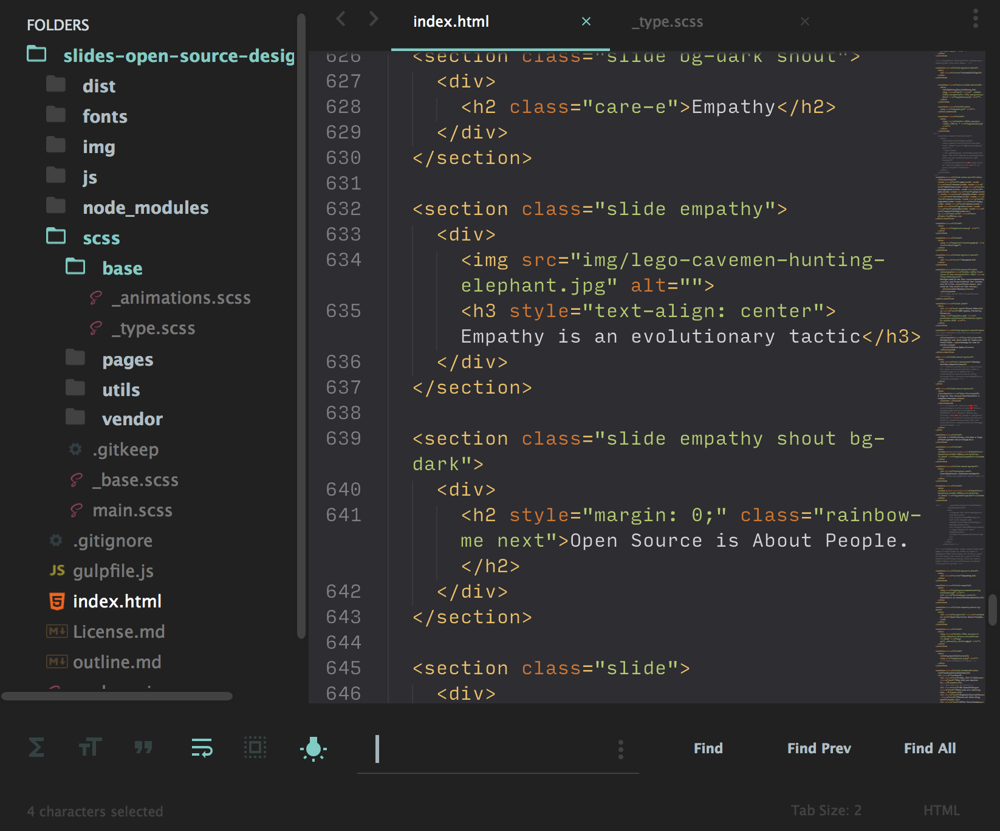

# dotfiles

Dotfiles and Configurations

## Index:

- [Sublime](/SublimeText)
  - [Sublime Plugin List](/SublimeText/sublime-plugins.md)
  - [Preferences.sublime-settings](/SublimeText/Preferences.sublime-settings)
  - [Material-Theme-Darker.sublime-theme](/SublimeText/Material-Theme-Darker.sublime-theme) (with alterations)
- Terminal Setup (zsh)
  - [.zshrc](/.zshrc) (/links to [.aliases.sh](/.aliases.sh))
- Git(hub)
  - [.gitconfig](/.gitconfig)
  - [.gitignore](/.gitignore)
  - [.editorconfig](/.editorconfig)
- Vim
  - [.vimrc](/.vimrc)

## Sublime Theme:

